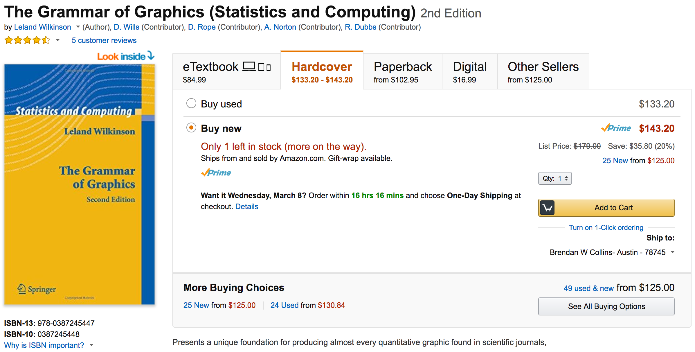
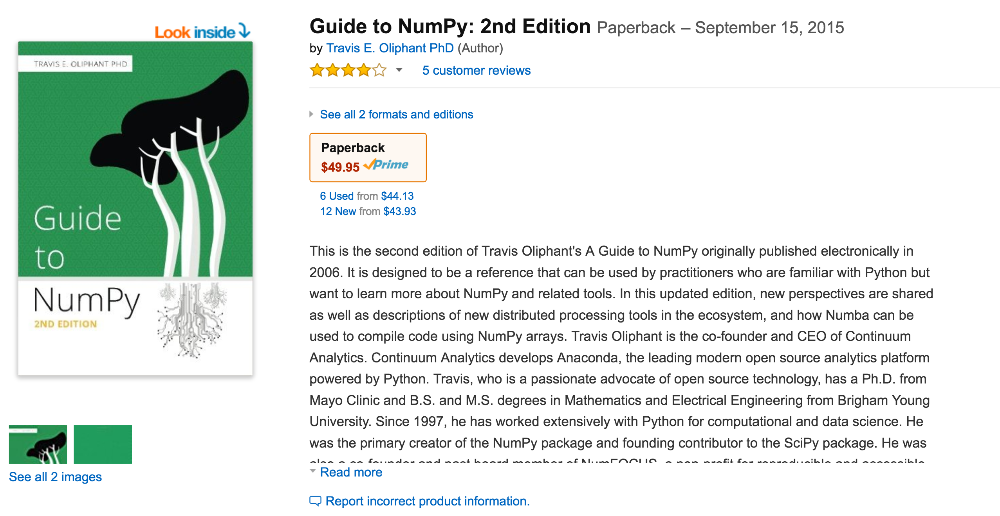

## Bokeh:
###Interactive Visualizations in Python

#### Bokeh: Getting started...

    $ conda install bokeh

    $ python

    Python 3.5.3 |Continuum Analytics, Inc.| (default, Mar  6 2017, 12:15:08)
    [GCC 4.2.1 Compatible Apple LLVM 6.0 (clang-600.0.57)] on darwin
    Type "help", "copyright", "credits" or "license" for more information.
    >>> from bokeh.sampledata import download
    >>> download()
    Using data directory: /Users/bcollins/.bokeh/data
    Downloading: CGM.csv (1589982 bytes)
       1589982 [100.00%]k
    Downloading: US_Counties.zip (3182088 bytes)
       3182088 [100.00%]
    Unpacking: US_Counties.csv
    Downloading: us_cities.json (713565 bytes)
        713565 [100.00%]
    Downloading: unemployment09.csv (253301 bytes)
        253301 [100.00%]

####Bokeh: Vector Geometries - Points

    from bokeh.plotting import figure, output_file, show

    x = [1, 2, 3, 4, 5]
    y = [6, 7, 2, 4, 5]

    output_file("bokeh-example-points.html")

    p = figure(title="simple point example",
               plot_height=400,
               plot_width=700,
               x_axis_label='x',
               y_axis_label='y')

    p.circle(x, y, size=10)

    show(p)

####Bokeh: Vector Geometries - Points
<iframe width="800px" height="450px" frameborder="0" scrolling="no" marginheight="0" marginwidth="0" src="examples/bokeh-example-points.html">

####Bokeh: Vector Geometries - Lines

    from bokeh.plotting import figure, output_file, show

    x = [1, 2, 3, 4, 5, 1]
    y = [6, 7, 2, 4, 5, 6]

    output_file("bokeh-example-lines.html")

    p = figure(title="simple line example",
               plot_height=400, plot_width=700,
               x_axis_label='x', y_axis_label='y')

    p.line(x, y, legend="Temp.", line_width=2)

    show(p)

####Bokeh: Vector Geometries - Lines
<iframe width="800px" height="450px" frameborder="0" scrolling="no" marginheight="0" marginwidth="0" src="examples/bokeh-example-lines.html">

####Bokeh: Vector Geometries - Polygons
    from bokeh.plotting import figure, output_file, show

    x = [1, 2, 3, 4, 5]
    y = [6, 7, 10, 7, 5]

    output_file("bokeh-example-polygon.html")

    p = figure(title="simple line example",
               plot_height=400,
               plot_width=700,
               x_axis_label='x',
               y_axis_label='y')

    p.patch(x, y, legend="Land Area",
            line_width=3, fill_color="#336699", fill_alpha=.6)

    show(p)

####Bokeh: Vector Geometries - Polygons
<iframe width="800px" height="450px" frameborder="0" scrolling="no" marginheight="0" marginwidth="0" src="examples/bokeh-example-polygon.html">

####Bokeh: Vecotr Geometries - Webgl
    from bokeh.plotting import figure, output_file, show
    from bokeh.palettes import Blues7

    N = 400000
    x_range = (int(-20e6), int(20e6))
    y_range = (int(-20e6), int(20e6))

    xs = np.random.uniform(x_range[0], x_range[1], N)
    ys = np.random.uniform(y_range[0], y_range[1], N)

    output_file("bokeh-example-points-webgl.html")

    p = figure(title="simple point example",
               x_range=x_range,
               y_range=y_range,
               plot_height=400,
               plot_width=700,
               webgl=True)

    p.circle(xs, ys, size=10)

    show(p)

####Bokeh: A Grammar of Graphics

####Bokeh: Raster - Image RGBA

    import numpy as np
    from bokeh.plotting import figure, show, output_file

    N = 20
    img = np.empty((N, N), dtype=np.uint32)
    view = img.view(dtype=np.uint8).reshape((N, N, 4))
    for i in range(N):
        for j in range(N):
            view[i, j, 0] = int(i/N*255)
            view[i, j, 1] = 158
            view[i, j, 2] = int(j/N*255)
            view[i, j, 3] = 255

    p = figure(x_range=(0,10), y_range=(0,10))
    p.image_rgba(image=[img], x=0, y=0, dw=10, dh=10)

    output_file("bokeh-example-image.html", title="image_rgba.py example")
    show(p)

####Bokeh: Raster - Image RGBA
<iframe width="800px" height="450px" frameborder="0" scrolling="no" marginheight="0" marginwidth="0" src="examples/bokeh-example-image.html">

####Bokeh: A Guide to Numpy

